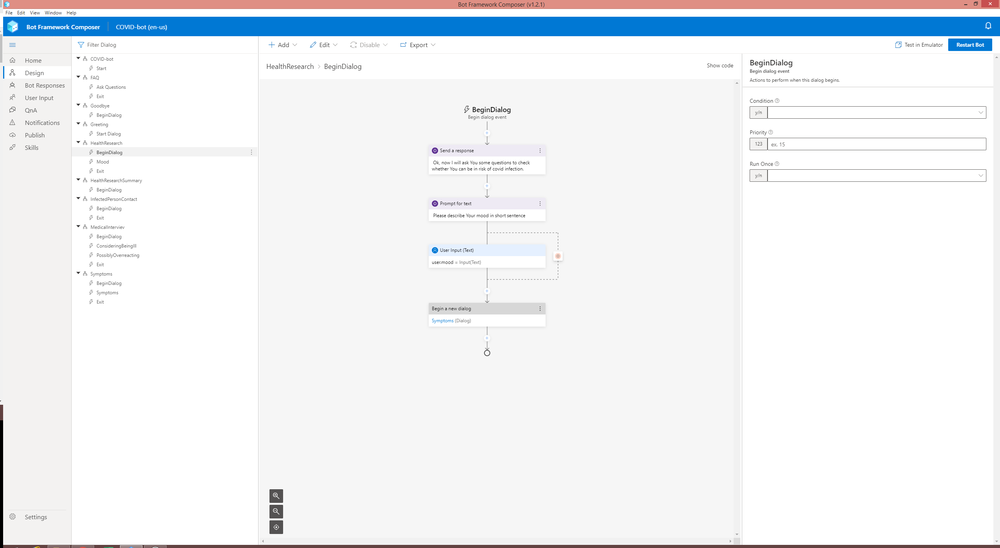
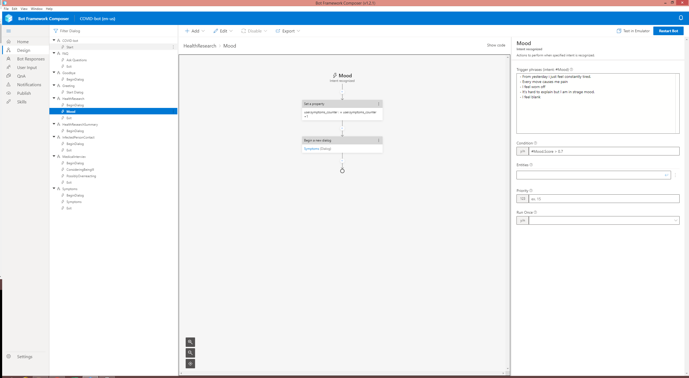

# Covid Bot

## Introduction

This is simple bot made for [studies classes](https://github.com/ekote/AI-on-Microsoft-Azure/tree/main/advanced-mgr). It combines two main functionalities:

- Provide answers to popular questions
- Carry out simple automated medical interview

It's main purpose is to populate knowledge about pandemics and automate the process of human work helpdesks making first contact with probably infected people. Bot uses [LUIS](https://azure.microsoft.com/pl-pl/services/cognitive-services/language-understanding-intelligent-service/) and [QnA Maker](https://azure.microsoft.com/pl-pl/services/cognitive-services/qna-maker/#features) Azure services.

## Usecases

There are two major usecases that bot covers.

1. First is about askins common questions to people which find themselves in a position of probable infection. At first bot asks what can it help with, then user interacts with it by choosing 'I need help' option. It indicates that bot listens to what do user have to say. If it considers that input is suspicious in case of pandemics it directs user to ask three questions - about current mood, possible symptoms and possibility that user had interaction with someone infected. By this means bot extracts information about possible occurence of infection and gives feedback to the user.
2. The second one covers the FAQ section about covid. Having the databasse of questions and answers provided by Azure QnA Maker service it uses text processing AI based tools to find most fitting answers to sent questions.

The two above can be highly combined and interspersed during almost every state of application.

App is capable of stopping it's work at any time and bot's state after detection of 'exit' keyphrase as input.

## QnA Maker database

Database was filled with translated FAQ from official polish government sites [1](https://www.gov.pl/web/koronawirus/pytania-i-odpowiedzi) [2](https://pacjent.gov.pl/aktualnosc/podejrzewasz-ze-masz-koronawirusa).

## Bot Architecture

Bot consists of multiple parts that can be extracted:

- Beginning - section where bot greets and shows us possibilities what can we do

Starting bot, initializing memory properties, and setting basic flow

Simple decision tree

- Medical interview - bot asks questions and decides which actions should be done regarding the inputs

Beginning the interview, deciding if user can possibly be infected

User is possibly overreacting or doesn't believe in pandemics so bot user if he wants to ask some questions -> FAQ

Asking what is users mood

Asking about possible symptoms of disease

Asking if user is aware of meeting someone infected

Deciding what actions would be the best in current situation

- FAQ - bot answering questions until user says it's enough

Telling user to feel free to ask questions and answering them as long as user says he doesn't want to ask more

- Breaks - switching current state from answering questions to interviewing and vice versa

  - Exit - user can exit the bot almost in every case
  

  - Detect overreaction/misinformation  - bot asks if user wants some knowledge from QnA base since he seems sceptic or uninformed
  

  - Detecting suspicious signs - bot detects which of user input is suspicious and tells if it could be dangerous

  
  
  