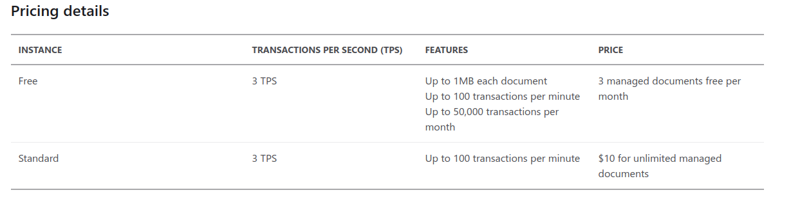

# Create Intelligent Bots with the Azure Bot Service

## QnA Maker

1. Introduction
    1. Service presentation

        QnA Maker service is server which enables creating databases with questions and answers. It's main purpose is to build a knowledge base which then can be interactively shared with bots to users. It's use is commonly bound with conversational bots. It is capable of creating multiple definitions to the same question. This makes use of database more general and more humanlike when bot returns required answer and no exception because the question was formulated differently than bot expected.

    2. What does this server?

        Server is mainly an intelligent database which is optimal for conversional bots. Sending a request to server results in getting an answer to question in response. To make the response more human-like a process of model training is applied based on defined phrases in database. Since the bot has natural language processing tools included, it teaches himself how to answer differently formulated questions indicating the same thing. The service big advantage is out of the box integration with Azure Bot Service. Because of that every created bot, can make use of previously defined FAQ database without need of copying resources or redefining database.

2. Use cases
    * Conversional bots
    * Database for Interactive FAQ portal
    * Processing MSForms answers sections

3. How to
    1. Service usage

        Firstly a developer needs to create QnA Maker service in order to create database. Managing database and service can be done using QnA Maker web portal. Creating a QnA Maker service can be simplified to following steps:

        * Defining questions and answers - supplying database with data from FAQ documentation, imported chit-chat datasource or created manually in portal.
        * Training and testing knowledge database - this step applies natural language processing model to match different questions to same answers.
        * Publishing the database - making the endpoint accessible for client applications (ex.bots)

        Final step is creating application making use of database.

    2. Service pricing

        

## Bot Framework Composer

1. Introduction
    1. Tool presentation

        Bot Framework Composer is toll that enables creating Azure Bots using graphical interface. It's main feature is to create bots using visual blocks not code. It makes it more accessible to non technical users, but it requires some basic programming knowledge.

    2. What can be done using the tool?

        Tool is capable of creating and managing bots. With the use of Bot Framework Emulator tool it can be tested offline before publishing the bot. Basic bot consists of Adaptive dialogs that can be customized for specific bot applications. Dialog consists of:

        * User input recognition which changes user input to intents, and entities which bot is capable of understanding.
        * Triggers - dialogs that are being initiated rigth after user call. Triggers can interrupt another dialogs, making them to stop regardless how many data have they acquired.
        * Actions - steps that have to be made after trigger being activated.
        * Bot output - creating bot's response to user input regarding acquired data.

        Every bot has a memory which stores information shared and acquired from bot and interaction with user.

2. Use cases
    * Developing new bot
    * Deleting or replacing old bot
    * Testing new bot structure
    * Testing bot's performance

3. How to
    1. Tool usage

        Fistly Bot Framework Composer and Bot Framework Emulator should be installed. After running Bot Framework Composer we can create new bot which is initialized with basic welcome dialog. One bot can have multiple dialogs depending on when they should get called. Dialogs defined a sequence of bot-user interaction. Every dialog can have trigger which reacts to specific user inputs. Defining trigger is bound if defining action that follows the trigger. Action is very similar to defining dialog window. Action can for example start new dialog or manage stored data. Triggers can be bound with reacting to specific input, searching for regular expressions or making use of LUIS, which analyses data and can make more complex decisions than regex. Different kind of actions can be defined in dialogs, starting from showing a simple responce, ending on searching the web for information and showing it to user in processed way (for example weather in tile or showing options as buttons). Final step of creating a bot is compiling it and testing using Bot Emulator. Bot emulator is a regular window with basic UI in which everyone can test major functionality without putting effort in creating additional user interface.

    2. Tool pricing

        Both Bot Framework Composer and Emulator are free to use. They require only .NET SDK installed.