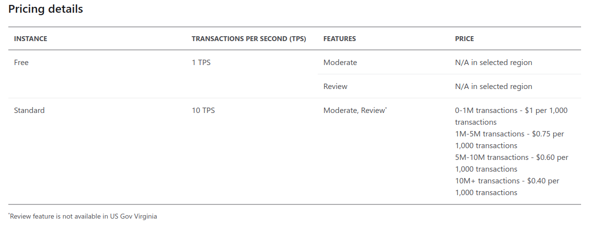
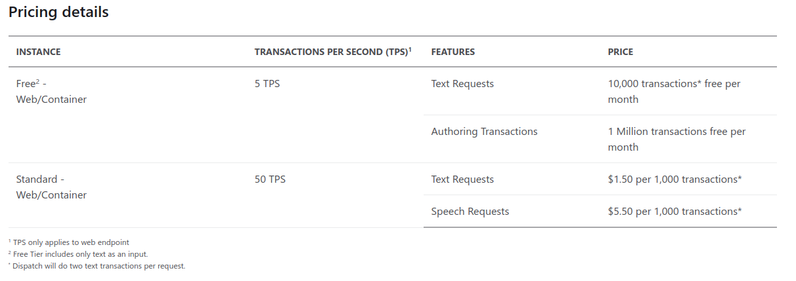
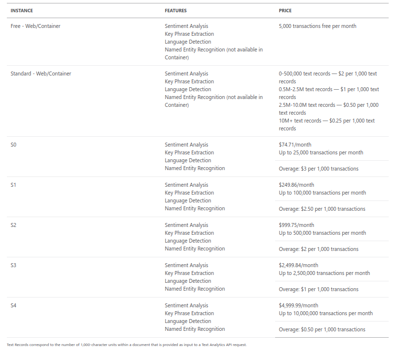

# Evaluate text with Azure Cognitive Language Services

## Azure Content Moderator

1. Introduction
    1. Service presentation

        Service moderates image, text and video data. It's main functionality is to analyze input data and in return give information about text, image or video in case of approving it's suitability for all users.

    2. What does this server?

        Service works on data and returns information if it's content should be blocked, approved or returned as needing review from human moderator. It's main text analysis functionalies are: detect profane terms, classify content as sexually abusive or offensive and check if text has personal data included.

2. Use cases
    * detect keywords in emails for. ex. "In the following attachment..." and inform user when no attachment is uploaded
    * block product placement on online forums
    * moderate live chats and ban restricted content
    * assist for web crawler/parser looking for personal data/emails

3. How to
    1. Service usage

        One need to acquire key and hostname/endpoint to Content Moderator instance. After getting this data it is possible to send POST request specifing host, key, content type and piece of data to analyze. Data type could be text or image. With this service anyone can analyze text in case of restricted contents, define its language, find faces on images, match images or find text on image. Text can be analyzed using html, xml, markdown or plain structure.

    2. Service pricing

        Service pricing selected for West Europe Region.

        

## Language Understanding Intelligent Service (LUIS)

1. Introduction
    1. Service presentation

        LUIS purpose is to interact  with user using conversational intelligence in apps. The main purpose of service is to understand the intents which are not always predictable based on single words, but can be found "between the lines".

    2. What does this server?

        This server takes text as input, analyses utterances, extracts keywords and predicts text's main purpose. Service predicts main subject of input texts, finds the intents and context of data.

2. Use cases
    * psychological bot assistant helping to cure mental illnesses
    * spying bot detecting terrorism dangers
    * alexa/siri like text assistents

3. How to
    1. Service usage

        In order to use LUIS it is needed to have own LUIS resource in Azure portal. Next step is to create app, for instance using eu.luis.ai website. Next library of intents and entities needs to get created in order to make LUIS detecting keyphrases and understandind their combination. It's purpose is to show how some phrases get interpreted into simple keyphrase. To apply our model we need to train it on given intents and entities sets. After model is trained we need to publish it in case to make the endpoint accessible. It is possible to access the service and sending a request to given URLs. LUIS app portal has it's own test section implemented so for minimal scale testing it is fairly sufficient.

    2. Service pricing

        

## Text Analytics API

1. Introduction
    1. Service presentation

        This api probvides discovering sender sentiment and emotions in text messages. It is sensitive to key phrases showing the emotions and sentiment passed with message.

    2. What does this server?

        This server provides natural language processing over raw text leaving the sentiment feedback as it's output. It is also capable of identifying language, extracking key phrases and detecting well-known (popular?) entities from text. Given resource focuses on detecting emotional feedback extracted from text. API can also be used to map requirements with solutions in case of feedback analysis and generating automatic answers.

2. Use cases
    * feedback analyzer
    * youtube comments section bot analysing how the content of video was received by commentators
    * email filter which marks emails to folders based on emotional message included in it's intents

3. How to
    1. Service usage

        In order to use service resource on MS Azure needs to be created. Then for example using [Link](https://northeurope.dev.cognitive.microsoft.com/docs/services/TextAnalytics.V2.0/operations/56f30ceeeda5650db055a3c9/console) we get guided how can we test created text analytics api. It is also possible to call api using system based terminal for example powershell or bash. There are also examples how to ask api using programming langyages such as pearl, java and python. Every method uses POST command. Request for sentiment API bases on sending JSON including documents list. Every document contains language, id and text section key which needs to be filled. Basing on this information we get response aiming target id and score which indicates positive (close to 1), ambivalent (circa 0.5) or negative attitude (close to 0).

    2. Service pricing

        
