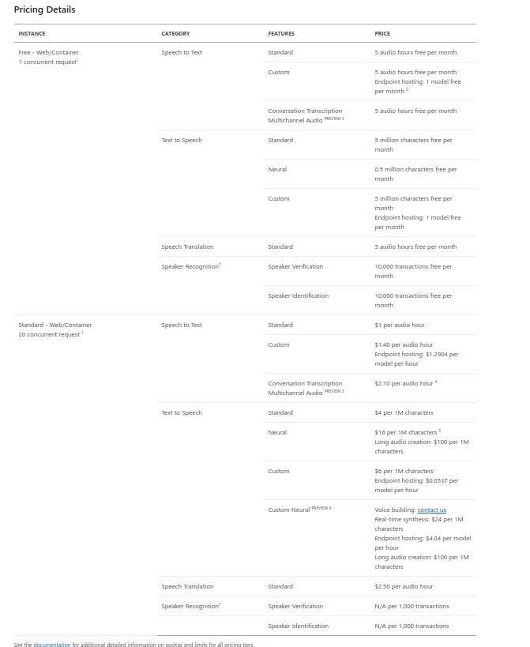

# Process and Translate Speech with Azure Cognitive Speech Services

## Speech service

1. Introduction
    1. Service presentation

        Main purpose of service is to process natural language. It is capable of converting text to audio, audio to text and processing it's contents. It is highly compatible with cross platform applications through REST or SDK client libraries and other Azure services like LUIS.

    2. What does this server?

        It provides real-time transcription of audio. Server has multiple possibilities:
        - Speech-to-Text - transcribes audio streams into text
        - Text-to-speech - converts audio to written text with human-like voices or neural synthesised one
        - Translate speech - capable of robust, automatic and machine based speech translation

2. Use cases
    * Online international meetings
    * Translations during international conferences
    * International speeddating meetings
    * Text to audiobooks converters and viceversa
    * Movie from subtitles dubbing
    * Siri/google home like assistents
    * Speech to text language tranlsation
    * Speech to speech language tranlsation

3. How to
    1. Service usage

        Firstly it is needed to create approperiate `Speech` service at Azure portal. Then we have to acquire subscription key to authenticate transactions and endpoints where we send requests through network. Next step is to decide whether You use C# or Python SDK. With decision made we can start writing programms (tutorials are provided on official ms site). Additionally it is possible to check which languages are implemented in Speech service.

        1. Speech-to-text

            Service can work with real-tome sent audio. It is capable of converting `wav` audio files into text.

        2. Text-to-speech

            Using the service we can receive audio with selected woman or man like voice. It is also possible to receive audio file as a server response. Using the service requires only sending text as string represented in Azure SDK specific way. All of mentioned is being taken care of under SDK's API. For large text files a Long Audio API is required.

        3. Translate speech

            It is possible to convert one language to multiple another one's at the same time. API provides multiple options like translating speech to text from real-time input, speech to speech and speech to multiple language simultaneously.

    2. Service pricing

        

        