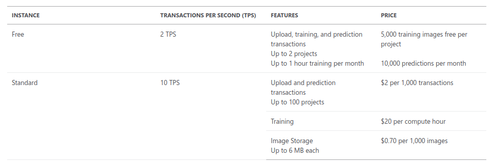

# Evaluate the requirements for implementing the Custom Vision APIs

## Custom Vision

1. Introduction
    1. Tool presentation

        It broadens the vision of using Custom Vision API. It describes writing automatic model deployment through specific REST api calls - to minimize manual work.

    2. What can be done using the tool?

        Through REST API calls developer can:
        * create object detection models
        * create classifiers
        * upload images
        * tag images
        * perform training
        * manage model iterations
        * make predictions

2. Use cases

    Described [here](./Classify\ images\ with\ the\ Microsoft\ Custom\ Vision\ Service.md)

3. How to
    1. Tool usage

        Calling an API requires Http client library implementation in given programming language. It doesn't even require special SDK to be used. Shown examples are written in python and C#. To make use of service we must supply prediction key in request. Otherwise prdeiction won't get authorized and won't create response.

        Through writing scripts (C# example) it is possible to create a file stream and send images from local disk to a model. It can be done in order to preprocess images and for prediction purposes. There is also extended instruction on how to create good json requests and how to process responses.

    2. Tool pricing

        