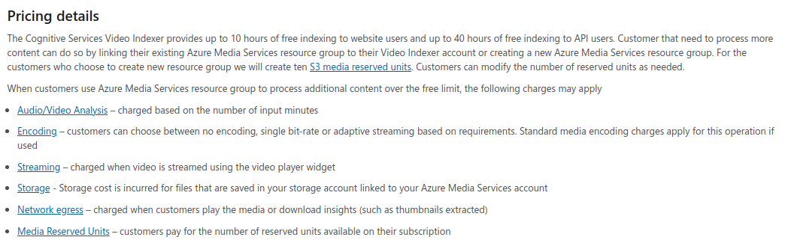

# Extract insights from videos with the Video Indexer service

## Video Indexer

1. Introduction
    1. Tool presentation

        Video indexer is a Azure tool which enables user to upload video and extract multiple description keywords and detect multiple features.

    2. What can be done using the tool?

        Out of video with use of Video Indexer the following data can be obtained:

        * transcript
        * ocr
        * keywords
        * labels
        * faces
        * brands
        * sentiments
        * emotions

        Service bases and sometimes extends the possibilities from Face API, Emotions API, Computer Vision Service, Custom Vision Service.

2. Use cases

    * Creating thumbnails for videos for blog
    * Mobile ocr out of video applications
    * Mobile scanners for food product labels (for people with sight problems)
    * Create descriptions of what can be seen on image for people with sight problems

3. How to
    1. Tool usage

        Tool can be developed through web service or scripts. Video can be easily managed through portal, but there is a significant gap to automate video indexing or searching for specific moments in video by labels. Service is also capable of stream videos and store them on server. It is possible to chose video stream encoding or generate video insights.

    2. Tool pricing

        