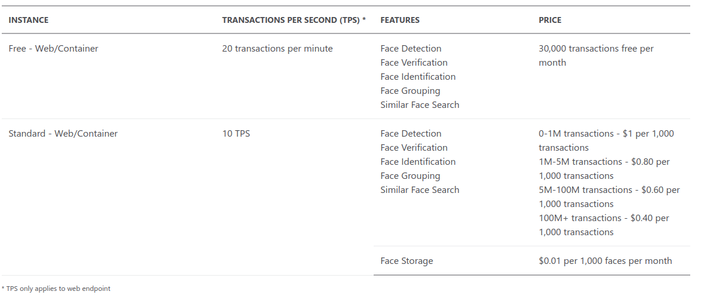

# Identify faces and expressions by using the Computer Vision API in Azure Cognitive Services

## Face API

1. Introduction
    1. Tool presentation

        Face API is Azure Service called as `Face`. It's main functionality is to detect face, it's location, parts of face or even match multiple faces and group them.

    2. What can be done using the tool?

        Main tasks:

        * face matching
        * providing face attributes
        * face characteristic analysis
        * organize people and their facial definitions

        Face API tasks five categories:

        * Verification: check if two faces belong to the same person
        * Detection: detect human faces on image
        * Identification: search and identify faces
        * Similarity: find similar faces
        * Grouping: Organize faces int groups based on their similarity

        Face API provides the following functionalities:

        * face location: bounding box of face
        * landmarks: find nose, eyes etc on image
        * attributes: predicts age, gender, hair color, smile etc.

        Check emotion of face on the image by using additional Emotion API. It is a wrapper for Face API with additional functionality.

2. Use cases

    * Find celebrities in crowds (for paparazzi's)
    * Enhance public video surveillance by looking for similar faces from arrest warrants or notices  (CCTV)
    * Creating Instagram/Facebook/Snapchat like face filters (detecting faces and deform them or detect specific parts of faces)
    * Add next level of security in nuclear plants (face identification)

3. How to
    1. Tool usage

        * Creating a Service

        At first user needs to create endpoint on Azure portal. It is called `Face` when looking for it in Azure portal. Endpoint adress and required keys are generated after service deployment on Azure server. To access them user needs to go to resource and find `Keys and Endpoint` tab.

        * Calling the Service

        It is mostly done through C# or Python SDK. Endpoint and Key to it is specified as environment variable in OS. To access Face API we need to write small piece of code (it is quite easy to use with provided instructions).

    2. Tool pricing

        
