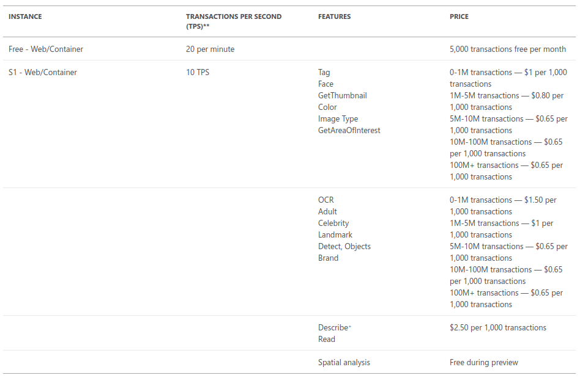

# Process images with the Computer Vision service

## Computer Vision

1. Introduction
    1. Tool presentation

        Computer Vision is another Cognitive Service in Azure. It is capable of describing and detecting multiple features on given photo.

    2. What can be done using the tool?

        Tool is capable of printing keywords describing photo, creating a thumbnail of given roi, detect adult and racist content or extract printed or handwritten text.

2. Use cases

    * 'Children secure' web browsing/computer usage
    * Converting Image pdfs to pure text
    * Automatic ID check while using automatic cash register

3. How to
    1. Tool usage

        Excercise was completed using online sandbox on official Microsoft site. What it does is create resource group and resources automatically. After 1 hour sandobox gets destroyed and all resource groups are deleted making the clean up process automatic.

        Using the tool requires creating Computer Vision service in Azure portal. After this step we can simply use curl or postman to send requests and receive responses. Requested functionality is specified as a endpoint attributes when calling it.

    2. Tool pricing

        