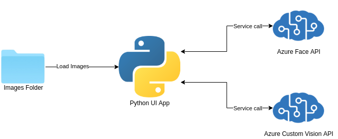

# Mask Placement Detector

This application is AI Azure Service based python app. It's main functionality is to detect if people on the photo have their masks worn properly.

## Background

Checking if people have their masks on is getting more and more tedious and still requires people interaction. Unfortunately such exposure may help spreading the disease. This specific app was created to meet the needs of automatic mask detection in stores or public places.

## Use case

Nowadays almost every shop or shopping center requires having mask on when entering. Most of the time it's security's job to check such requirement. This specific piece of software is first step to automate the process of customers control. Having camera installed at the entrance  we can proceed with analysis of given photo and alarm security when the rules of public place are violated.

Project focuses on making the analysis of given photo and marks whether detected face has mask worn well. For now user enters folder containing multiple images, chooses which image should be processed and then analyzes it. Software can be easily expandable to use images from CCTV in public places and alarm relevant staff.

## Resources

Application bases mainly on python using Azure Cognitive Services SDK and pysimplegui. Here is the list of used services:

* Azure Face API - used to detect faces from given photo. For this purpose `detection_02` model is the most suitable since it has significantly improved face detection compared to previous version. Main drawback of this model is it doesn't support face attributes recognition such as nose eyes, eyebrows etc. which limits possibilities of conclusion making process.
* Azure Custom Vision API - service based classifier. Used specifically to classify good or bad mask placement.

## Architecture



Presented diagram shows how the program flow looks like. At the beginning python UI starts. From this place we can browse computer for folder containing multiple images to analyze. All images are loaded from chosen folder and we can change which one should be shown and processed. After image choice it is being sent to analysis. Firstly the app sends photo to Azure Face Cognitive service to detect all faces on the image. After receiving Face API response only face areas are being sent to Azure Custom Vision service. After receiving information from multilabel classifier app draws rectangles on image with detected faces. If frame of face is red then programm thinks that someone is wrong with mask placement but if marked roi is green then everything is ok.

### Requirements

Project requirements are saved in `requirements.txt`. Please install them through pip on your machine or environment.

To make programme run properly make sure You have set the following local variables on Your machine:

```bash
COGNITIVE_FACE_API_KEY - Face Api subscription key
COGNITIVE_FACE_API_ENDPOINT - Face Api endpoint
COGNITIVE_CUSTOM_VISION_PREDICTOR_KEY - Custom vision predictor subscription key
COGNITIVE_CUSTOM_VISION_PREDICTOR_ENDPOINT - Custom vision endpoint
COGNITIVE_CUSTOM_VISION_PROJECT_ID - Custom vision project id (can be found in your project settings on customvision.ai website)
COGNITIVE_CUSTOM_VISION_PROJECT_ITERATION - Custom Vision project published iteration name (String representation, not code)
```

For myself i have created the following script which I source every time before launching app through `./UI.py <monitor_number>`:

```bash
#! /bin/bash

export COGNITIVE_FACE_API_KEY=<key>
export COGNITIVE_FACE_API_ENDPOINT=<endpoint>

export COGNITIVE_CUSTOM_VISION_PREDICTOR_KEY=<key>
export COGNITIVE_CUSTOM_VISION_PREDICTOR_ENDPOINT=<endpoint>
export COGNITIVE_CUSTOM_VISION_PROJECT_ID=<id>
export COGNITIVE_CUSTOM_VISION_PROJECT_ITERATION=<name>
```
